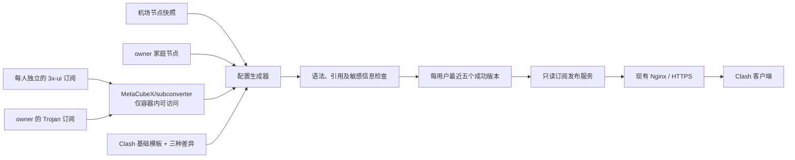

# Clash 私有订阅生成与发布服务设计

**日期：** 2026-08-21
**状态：** 已确认，待实施
**目标仓库名：** `my-clash-config`
**取代：** 2026-08-19 版设计及实施计划

## 1. 目标

为个人和少量受信任用户提供完整的 Clash 配置订阅：

1. 每位其他用户只获得自己独立的 3x-ui 客户端节点。
2. owner 获得自己的 3x-ui、Jrohy/Trojan、机场快照和家庭节点。
3. 从一份基础模板生成 `balanced`、`balanced-win`、`privacy` 三种完整配置。
4. 对外只发布最后一次成功生成的配置，不公开转换器、上游订阅或管理接口。
5. 保留三份现有配置的原始副本，以及每位用户最近五个成功发布版本。
6. 兼容 3x-ui 的流量及到期信息展示。

## 2. 非目标

- 不部署 `sub-web` 或其他在线转换页面。
- 不允许访问者提交任意 URL 让服务器代为转换。
- 不自动登录机场后台，也不保存机场登录 Cookie。
- 不把真实订阅 URL、节点凭据、公开令牌或生成结果提交到 Git。
- 不按固定时间重复生成内容相同的配置。
- 不实现可靠的设备绑定。Clash 订阅本质上仍是持有链接即可下载的 bearer credential。
- 不修改现有 Trojan 服务、443 SNI 分流方式或已有网页。

## 3. 命名和兼容范围

项目对外统一使用 **Clash** 命名：

- 仓库目标名为 `my-clash-config`。
- 管理命令为 `clash-sub`。
- 模板、输出文件、订阅路径和用户文档使用 Clash。

技术文档注明输出面向使用 Mihomo 内核的现代 Clash 客户端。内部继续使用上游的正式名称 `MetaCubeX/subconverter` 和 Mihomo 校验器，不对第三方项目错误重命名。配置可能包含 Mihomo 扩展，不承诺兼容停止维护的旧 Clash 内核。

## 4. 总体架构



部署包含两个常驻容器：

- `subconverter`：仅在 Compose 网络内提供规范化转换，不映射公网端口。
- `publisher`：只读取成功发布的静态文件，通过宿主机回环端口交给 Nginx。

生成器和 Mihomo 校验器按命令临时运行，不常驻、不提供公网接口。

## 5. 现有服务器集成

服务器已有 Jrohy/Trojan 和 Nginx，80/443 已被现有链路使用。新服务必须遵守：

1. Compose 不绑定 80 或 443。
2. `publisher` 仅绑定 `127.0.0.1`。
3. 新增订阅子域名的 Nginx HTTPS `server` 配置，并接入现有 1443 Web 入口。
4. 证书必须覆盖订阅子域名；不修改 Trojan 当前使用的证书。
5. 不改动现有 443 SNI 分流、Trojan fallback 和原网页配置。
6. 部署脚本修改 Nginx 前先备份目标片段，执行配置检查成功后才 reload。

## 6. 模板设计

当前未跟踪目录 `1/` 中的三份完整配置是本次迁移的权威参考：

- `My-Clash_Balanced.yaml`
- `My-Clash_Balanced_Win.yaml`
- `My-Clash_Privacy.yaml`

实施时先将它们原样移动到：

```text
private/reference-configs/2026-08-21/
```

这些文件永久保留、只读、被 Git 忽略，任何生成操作不得覆盖。

可维护模板采用：

```text
templates/
  clash.yaml.j2
  variants/
    balanced.yaml
    balanced-win.yaml
    privacy.yaml
```

`clash.yaml.j2` 保存公共结构和明确的节点注入位置。三个 variant 文件只描述真实存在的差异，例如 DNS、策略组、规则或平台设置；不在 Python 代码中硬编码业务配置。

首次迁移必须把三个生成结果与三份参考配置进行结构对比。除节点来源改为动态注入以及明确批准的生成字段外，DNS、代理组、规则顺序和模式差异都应保持一致。

## 7. 私有数据模型

建议的私有目录如下：

```text
private/
  config/
    users.yaml
  reference-configs/
    2026-08-21/
  sources/
    owner/
      airport.yaml
      home.yaml
  releases/
    <user-id>/
      <release-id>/
        <variant>.yaml
        <variant>.meta.json
        manifest.json
  current/
    <user-id> -> ../releases/<user-id>/<release-id>
```

仓库只提交无敏感值的 `users.example.yaml` 和示例节点结构。真实 `private/` 设置为目录权限 `0700`，文件权限 `0600`。

每位用户至少包含：

- 内部用户 ID。
- 独立 3x-ui 订阅 URL。
- 允许访问的 variant 列表。
- 公开令牌的安全哈希，而不是可还原的明文令牌。
- 当前发布版本和最后一次成功状态。

owner 额外包含稳定的 Trojan 订阅 URL，并引用机场快照和家庭节点文件。其他用户不得声明或继承 owner 来源。

## 8. 节点来源和隔离

| 用户 | 允许的节点来源 |
| --- | --- |
| 其他用户 | 仅该用户自己的 3x-ui 客户端 |
| owner | owner 3x-ui + owner Trojan + 机场快照 + 家庭节点 |

3x-ui 和 Trojan 的稳定订阅由内部 subconverter 转为统一节点结构。输出配置直接包含转换后的节点，不包含上游订阅 URL。

机场更新流程：

1. 用户在机场长期入口中登录并生成五分钟临时订阅 URL。
2. 手机 SSH 到服务器后执行 `clash-sub airport`。
3. 命令通过隐藏输入读取 URL，不把它放入 shell history、环境变量或进程参数。
4. 服务器立即下载、转换并验证节点。
5. 验证成功后原子替换 `private/sources/owner/airport.yaml`，立即生成 owner 的三份配置。
6. 临时 URL 不落盘；失败时保留旧机场快照和旧配置。

如果机场要求生成链接和下载链接使用同一公网出口，Quantumult X 只需把机场后台域名定向到服务器现有 Trojan 节点，无需切换手机的全局代理模式。

家庭节点由 owner 手工维护。当前参考配置中的 Jrohy/Trojan 节点改为稳定 Trojan 订阅来源，其余内联节点归入 owner 家庭节点。

不同来源出现同名节点时，仅冲突节点追加 `[3x-ui]`、`[Trojan]`、`[机场]` 或 `[家庭]`。代理组同步引用最终名称。

## 9. 生成和发布流程

本项目不设置定时生成任务。生成只由以下事件触发：

- 首次部署。
- 执行 `clash-sub refresh` 或针对单一用户 refresh。
- 成功导入机场订阅。
- 修改模板、用户来源或家庭节点后手动 refresh。

一次生成执行：

1. 读取指定用户允许的来源。
2. 通过内部 subconverter 拉取和规范化订阅。
3. 合并节点并解决名称冲突。
4. 根据基础模板和 variant 生成完整 Clash YAML 到 staging 目录。
5. 验证 YAML 语法、必需字段、节点名称唯一性及代理组引用。
6. 检查输出中没有上游订阅 URL、临时机场 URL或公开令牌。
7. 使用固定版本的官方 Mihomo 内核执行真实配置检查。
8. 写入 manifest 和流量元数据。
9. 将该用户的 `current` 符号链接原子切换到新 release。
10. 删除该用户超出五个的旧成功版本。

任一步失败都不得改变 `current`。owner 的三个 variant 是一个原子发布集合：必须全部通过或全部保留旧版本。其他用户相互隔离，一人的生成失败不阻止其他人继续使用已有版本。

参考配置不参与五版本清理，永久保留。

## 10. 客户端更新和流量元数据

服务器生成与 Clash 客户端更新是两个独立过程：

- 服务器只有在内容发生人工管理事件时才重新生成配置。
- Clash 客户端是否自动拉取由用户自己的客户端设置决定。
- 客户端未设置更新间隔时，需要手动点击更新。

公开订阅请求不会重新生成完整配置。publisher 返回当前成功版本，同时读取该用户 3x-ui 订阅响应的流量元数据，并以十分钟为上限缓存：

- `upload`
- `download`
- `total`
- `expire`

publisher 在响应中设置 `Subscription-Userinfo` 和兼容的订阅描述头。实时读取失败时返回最后一次成功缓存，不影响配置下载。`total=0` 按不限量处理。

owner 的合并配置只展示 owner 3x-ui 的流量额度，不把机场、Trojan 和家庭节点虚构成统一配额。其他用户展示各自 3x-ui 客户端的额度。

## 11. 公开接口

公开订阅路径格式：

```text
https://<订阅子域名>/s/<高强度随机令牌>/<variant>.yaml
```

令牌至少使用 32 字节密码学安全随机数。publisher 对请求令牌做哈希并与保存的哈希比较，不持久化可还原的公开令牌。

接口规则：

- 令牌只能访问绑定用户允许的 variant。
- 不提供用户列表、目录浏览、历史版本或任意文件路径。
- 不提供 `/sub`、`/getprofile`、转换参数、管理页面或上传接口。
- 不把源订阅 URL、内部错误堆栈或文件路径返回给客户端。
- 对不存在的令牌和不存在的配置返回相同形式的 404，减少枚举信息。
- 设置合理的请求频率限制和响应大小上限。

## 12. 管理命令

服务器安装单一命令 `clash-sub`，不提供兼容别名。无参数和 `help` 都显示简洁帮助：

```text
clash-sub
clash-sub help
clash-sub status
clash-sub refresh
clash-sub refresh <user-id>
clash-sub airport
clash-sub history <user-id>
clash-sub rollback <user-id>
clash-sub rotate-link <user-id>
clash-sub logs
```

命令行为：

- `status` 显示最后成功版本、生成时间、来源状态，以及输入文件哈希变化导致的“待重新生成”，但不显示 URL 或凭据。
- `refresh` 默认生成全部用户；带用户 ID 时仅生成该用户。
- `airport` 完成安全导入并自动刷新 owner。
- `history` 只列成功版本。
- `rollback` 原子切换到已有成功版本。
- `rotate-link` 生成新令牌、只保存哈希并将完整新 URL 显示一次。
- `logs` 默认对 URL、令牌和节点凭据脱敏。

一键部署结束时打印同一份速查表。忘记命令时只需输入 `clash-sub`。

## 13. 3x-ui IP 限制

每位使用者对应独立的 3x-ui client。3x-ui 的 `Limit IP` 限制同时观察到的公网源 IP 数，不是精确设备数或连接数，并由 3x-ui/Fail2ban 执行。

建议其他用户从 `Limit IP = 2` 开始；严格单出口场景可设为 `1`。该值由管理员在 3x-ui 面板配置，本服务不保存 3x-ui 管理员凭据，也不尝试修改面板设置。

已知边界：

- 同一 NAT 后多台设备可能只算一个 IP。
- 单一设备切换 Wi-Fi 和移动网络可能算两个 IP。
- CDN、IP Tunnel 或未正确传递真实 IP 时可能不准确。
- 限制只约束 3x-ui 节点，不能约束机场、家庭或独立 Trojan 节点。

## 14. 安全设计

1. 公开订阅令牌视为密码；用户主动转发后无法阻止对方下载已展开的节点配置。
2. 每人独立 3x-ui 凭据、令牌、配额和到期时间，泄漏时可单独撤销和轮换。
3. owner 的来源只进入 owner release；测试必须验证跨用户零泄漏。
4. Nginx 不记录带令牌的完整路径。publisher 只记录内部用户 ID、variant、状态和时间。
5. 日志不得包含上游 URL、节点密码、UUID、公开令牌或机场临时 URL。
6. 所有敏感目录、生成配置、缓存和历史 release 均由 `.gitignore` 覆盖。
7. Compose 镜像使用固定版本，不使用无法复现的 `latest`。
8. 容器采用只读文件系统、最小权限和非 root 用户；仅生成器拥有 release 写权限。
9. publisher 只读挂载 `current` 和元数据；不能调用生成器或修改 private 数据。
10. 不使用 Basic Auth 作为 Clash 客户端兼容性的必要条件，也不依赖移动 IP 白名单。

## 15. Docker Compose 边界

Compose 至少包含：

- `subconverter`：仅 `expose` 容器端口，供生成器访问。
- `publisher`：映射一个 `127.0.0.1:<port>` 端口供宿主 Nginx 反代。
- `generator`：通过 Compose profile 或 `run --rm` 按需执行。
- `validator`：固定版本 Mihomo 镜像，按需执行配置检查。

`subconverter` 与 `publisher` 不共享写权限。publisher 不需要访问源订阅文件；流量元数据读取通过最小化的用户映射和只读凭据完成。

## 16. 验收标准

### 模板与输出

- 一份基础模板生成三种结构不同且符合参考配置的完整 YAML。
- 三种输出均通过 YAML 解析和 Mihomo 真实配置检查。
- 所有代理组引用均指向有效节点、其他代理组或内置动作。
- 同名节点处理稳定且可重复。

### 用户隔离

- 每位普通用户输出只包含自己的 3x-ui 节点。
- owner 输出包含四类获准来源。
- 普通用户输出中不存在 owner 节点名称、凭据或来源痕迹。
- 用户令牌不能访问未授权 variant 或其他用户文件。

### 发布可靠性

- 失败生成不改变当前版本。
- owner 三份配置只能整体成功切换。
- 每用户仅保留最近五个成功版本，参考原件不清理。
- rollback 不重新转换即可恢复指定成功版本。
- 项目不存在自动定时生成任务。

### 流量与客户端

- 响应正确附带该用户的 `Subscription-Userinfo`。
- 上游不可用时仍能下载当前配置，并回退到缓存元数据。
- 请求订阅不会触发完整配置生成。

### 部署与安全

- `docker compose config` 通过。
- 公开网络只能到达 Nginx 和 publisher 允许的订阅路径。
- subconverter、生成器、validator 和管理命令均不能从公网访问。
- 敏感信息扫描覆盖提交内容、日志和公开响应。
- 一键部署不覆盖现有 Trojan/Nginx 配置，Nginx 检查失败时不 reload。

## 17. 实施顺序

1. 安全迁移并保护三份参考配置。
2. 建立私有数据 schema、Git 忽略和泄漏检查。
3. 用测试驱动方式完成单模板三 variant 渲染。
4. 实现来源转换、用户隔离和 owner 多来源合并。
5. 实现 staging、验证、原子发布、五版本保留和回退。
6. 实现只读 publisher、流量头和令牌授权。
7. 实现 `clash-sub` 管理命令。
8. 更新 Compose，移除 sub-web，加入内部 MetaCubeX/subconverter。
9. 编写现有 Trojan/Nginx 环境的一键部署和回滚说明。
10. 完成端到端、安全和故障回退验证。

具体文件、测试和提交粒度由新的实施计划定义；旧的 2026-08-19 实施计划不得执行。
