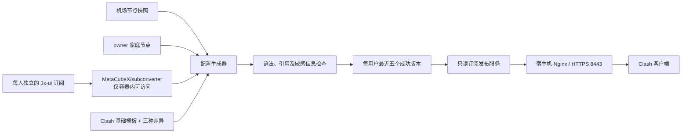
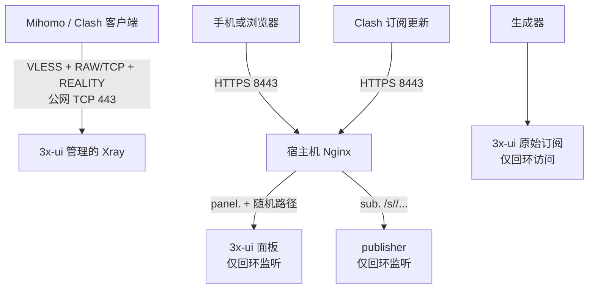

# Clash 私有订阅生成与发布服务设计

**日期：** 2026-08-21
**状态：** 设计已通过
**目标仓库名：** `my-clash-config`
**取代：** 2026-08-19 版设计及实施计划，以及本设计复审前形成的 2026-08-21 旧实施计划

## 1. 目标

为个人和少量受信任用户提供完整的 Clash 配置订阅：

1. 每位其他用户只获得自己独立的 3x-ui 客户端节点。
2. owner 获得自己的 3x-ui、机场快照和家庭节点。
3. 从一份基础模板生成 `balanced`、`balanced-win`、`privacy` 三种完整配置。
4. 对外只发布最后一次成功生成的配置，不公开转换器、上游订阅或管理接口。
5. 保留三份现有配置的原始副本，以及每位用户最近五个成功发布版本。
6. 兼容 3x-ui 的流量及到期信息展示。

## 2. 非目标

- 不部署 `sub-web` 或其他在线转换页面。
- 不允许访问者提交任意 URL 让服务器代为转换。
- 不自动登录机场后台，也不保存机场登录 Cookie。
- 不把真实订阅 URL、节点凭据、公开令牌或生成结果提交到 Git。
- 不按固定时间重复生成内容相同的配置。
- 不实现可靠的设备绑定。Clash 订阅本质上仍是持有链接即可下载的 bearer credential。
- 不在旧 Jrohy/Trojan 系统上做原地迁移；目标环境是重装后的干净服务器。
- 不让订阅服务或 3x-ui 面板占用公网 443。
- 不依赖自有域名提供 REALITY 节点。

## 3. 命名和兼容范围

项目对外统一使用 **Clash** 命名：

- 仓库目标名为 `my-clash-config`。
- 管理命令为 `clash-sub`。
- 模板、输出文件、订阅路径和用户文档使用 Clash。

技术文档注明输出面向使用 Mihomo 内核的现代 Clash 客户端。内部继续使用上游的正式名称 `MetaCubeX/subconverter` 和 Mihomo 校验器，不对第三方项目错误重命名。配置可能包含 Mihomo 扩展，不承诺兼容停止维护的旧 Clash 内核。

## 4. 总体架构



部署包含两个常驻容器：

- `subconverter`：使用 Linux host network 访问 3x-ui 回环订阅，自身只监听宿主机回环地址，不映射公网端口。
- `publisher`：只读取成功发布的静态文件，使用 Linux host network 访问 3x-ui 回环订阅，并且自身只监听宿主机回环地址交给 Nginx。

生成器和 Mihomo 校验器按命令临时运行，不常驻、不提供公网接口。

## 5. 服务器与网络架构

目标环境是重装后的干净服务器。Jrohy/Trojan、`trojan-web`、旧 MariaDB、Portainer 和旧 Nginx 配置均不迁移；本项目也不提供在旧环境中原地删除这些组件的脚本。

### 5.1 旧服务器只读核查结论

重装决定前已对旧服务器做过只读核查，确认历史记录对应的真实结构是：

- 公网 443 由 Trojan-Go 直接监听，并非 Nginx stream。
- 公网 80 由 `trojan-web` 监听。
- Trojan 的 `remote_addr:remote_port` 是 `127.0.0.1:80`，普通非 Trojan HTTPS 请求会进入 `trojan-web`。
- Trojan 的 `ssl.fallback_addr:fallback_port` 是 `127.0.0.1:1443`。
- Nginx 监听 8080 和 1443；8080 是为避开 `trojan-web` 的 80 而移动的 Debian 默认站点，并未被 Trojan 的 `remote_port` 使用。
- Nginx 1443 仍引用已删除的旧域名证书，运行进程内保留的证书也已过期，因此 `nginx -t` 失败。
- Nginx 二进制具备动态 stream 能力，但 stream 模块未安装或加载。
- 主机输入策略为 accept；3x-ui、Portainer 和 MariaDB 等端口曾绑定所有网卡。
- Docker 已安装，但 Docker Compose 插件缺失。

这段记录只用于解释旧环境和重装原因。新安装器检测到 Trojan、`trojan-web`、旧数据库容器或冲突端口时必须停止，不得猜测或自动清理。

### 5.2 目标端口拓扑

重装后的固定拓扑为：



端口职责：

| 端口 | 公网状态 | 服务 | 说明 |
| --- | --- | --- | --- |
| TCP 443 | 开放 | Xray VLESS + RAW/TCP + REALITY | REALITY 独占，不经过 Nginx |
| TCP 8443 | 开放 | Nginx HTTPS | 按子域名分流面板和订阅 |
| TCP 80 | 开放 | Nginx ACME HTTP-01 | 只服务证书验证及通用跳转或 404 |
| SSH 端口 | 开放 | sshd | 由服务器管理员指定，不由本项目更改 |
| 3x-ui 面板、原始订阅、publisher、subconverter | 不开放 | 回环或 Compose 内网 | 防火墙和监听地址双重限制 |

不引入 Nginx stream、Trojan fallback 或公网 1443。8443 上的两个 HTTPS 虚拟主机使用不同 `server_name`，共享一个 Nginx 实例。

### 5.3 REALITY 入站

3x-ui 管理一个或多个 VLESS 客户端，但首个部署只需要一个共享入站：

- 公网监听 TCP 443。
- 传输为 RAW/TCP，安全层为 REALITY。
- 每个客户端使用独立 UUID、email、配额、到期时间和 3x-ui `subId`。
- 客户端 flow 使用 `xtls-rprx-vision`，fingerprint 使用受支持的常见浏览器指纹。
- Target 不能照抄教程；必须从新 VPS 实测 TLS 1.3、HTTP/2、X25519、可达性和网络位置后选择，SNI 必须匹配 Target 证书。
- short ID 不留空。私钥只在服务器保存，客户端和订阅只获得公钥。
- 为兼容 Mihomo，明确测试 REALITY 的最低客户端版本门槛；仅在确有需要时按 3x-ui 官方说明降低门槛，并记录其允许旧指纹的权衡。
- 3x-ui、Xray 和 Mihomo 都固定到已验证的明确版本；升级前用测试客户端验证，不自动追随 `latest`。

生成给客户端的自建节点地址默认使用 VPS 公网 IP，而不是自有域名。自有域名到期不会影响已经发布的 REALITY 节点。

### 5.4 域名、证书和无域名退路

主要入口使用长期保留的自有域名：

```text
https://panel.<domain>:8443/<随机后台路径>/
https://sub.<domain>:8443/s/<高强度随机令牌>/<variant>.yaml
```

一张 SAN 证书可同时覆盖 `panel.<domain>` 和 `sub.<domain>`；不要求通配符。Nginx 终止 8443 TLS，3x-ui 和 publisher 后端只使用回环连接。

域名是稳定、易记的管理和订阅入口，不是 REALITY 的依赖。更换 VPS 时只更新 DNS，用户链接保持不变。若将来不再续费域名，则切换为同一 IP authority 下的路径路由：

```text
https://<vps-ip>:8443/<随机后台路径>/
https://<vps-ip>:8443/s/<高强度随机令牌>/<variant>.yaml
```

无域名模式不能再依靠 `panel`/`sub` 两个 Host 分流，Nginx 必须把 `/s/` 交给 publisher、把独立随机后台路径交给 3x-ui，其余路径统一返回通用响应。它使用受信任的 IP 地址证书，不允许明文 HTTP 或要求用户关闭证书验证。IP 证书有效期短，只有在启用自动签发、自动 reload、到期检查和续期失败告警后才能作为正式入口。切换到 IP 入口时，每位用户只需更新一次订阅 URL；3x-ui UUID、REALITY 密钥和已生成配置不重建。

### 5.5 3x-ui 面板保护

面板为了手机访问而通过 `panel.<domain>:8443` 对外提供，但必须满足：

1. 3x-ui 面板只监听回环地址，原始端口不进入公网防火墙。
2. 使用独立面板子域名、随机且足够长的 Web Base Path、强密码和 2FA。
3. Nginx 正确代理 WebSocket、限制登录请求频率并隐藏无必要的产品响应头。
4. 未命中正确 Host 或路径时返回通用响应，不暴露面板端口、版本或内部路径。
5. 3x-ui 原始订阅服务也只监听回环地址，只允许生成器和元数据读取器访问。
6. 不依赖“随机路径”代替身份认证，也不把 3x-ui 管理员凭据交给订阅服务。

### 5.6 部署与防火墙约束

一键部署只负责本仓库的 Clash 服务、宿主机 Nginx、证书和防火墙，不下载或执行第三方 3x-ui 安装脚本。干净服务器必须先按文档安装固定版本的原生 3x-ui，完成管理员强密码、2FA、随机 Base Path、回环面板/原始订阅和一个可用 REALITY 客户端的人工初始化；这是部署本项目的明确前置条件。

项目安装器默认只执行只读 `preflight`，只有显式 `apply` 才安装缺失的 Docker/Compose、Nginx 和证书工具，写入本项目配置并收敛防火墙。它必须：

- 检查 80、443、8443 和配置的 SSH 端口冲突。
- 检查 Docker、Compose、Nginx、3x-ui/Xray、证书工具和防火墙状态。
- 验证已安装的 3x-ui/Xray 版本、监听地址和至少一个测试通过的 REALITY 客户端；缺少初始化时停止并给出操作清单。
- 拒绝在检测到 Jrohy/Trojan、旧数据库容器或无法识别的 443 服务时继续。
- 安装或生成配置前备份它将要替换的目标文件；不备份整台旧服务器，也不删除用户数据。
- 先验证 Nginx 和 Compose 配置，再启动或 reload。
- 将主机输入策略收敛为默认拒绝，只开放 SSH、TCP 80、TCP 443 和 TCP 8443；不默认开放 UDP 443。
- 确认 3x-ui 面板、原始订阅端口、publisher 和数据库没有绑定公网。

重装、磁盘清除、DNS 修改和实际执行 apply 都是仓库外操作，必须由用户单独确认。

## 6. 模板设计

当前未跟踪目录 `1/` 中的三份完整配置是本次迁移的权威参考：

- `My-Clash_Balanced.yaml`
- `My-Clash_Balanced_Win.yaml`
- `My-Clash_Privacy.yaml`

实施时先将它们原样移动到：

```text
private/reference-configs/2026-08-21/
```

这些文件永久保留、只读、被 Git 忽略，任何生成操作不得覆盖。

可维护模板采用：

```text
templates/
  clash.yaml.j2
  variants/
    balanced.yaml
    balanced-win.yaml
    privacy.yaml
```

`clash.yaml.j2` 保存公共结构和明确的节点注入位置。三个 variant 文件只描述真实存在的差异，例如 DNS、策略组、规则或平台设置；不在 Python 代码中硬编码业务配置。

首次迁移必须把三个生成结果与三份参考配置进行结构对比。除节点来源改为动态注入以及明确批准的生成字段外，DNS、代理组、规则顺序和模式差异都应保持一致。

## 7. 私有数据模型

建议的私有目录如下：

```text
private/
  config/
    service.yaml
    users.yaml
  reference-configs/
    2026-08-21/
  sources/
    owner/
      airport.yaml
      home.yaml
  releases/
    <user-id>/
      <release-id>/
        <variant>.yaml
        <variant>.meta.json
        manifest.json
  current/
    <user-id> -> ../releases/<user-id>/<release-id>
```

仓库只提交无敏感值的 `service.example.yaml`、`users.example.yaml` 和示例节点结构。真实 `private/` 设置为目录权限 `0700`，文件权限 `0600`。

`service.yaml` 保存全局私有部署值，包括 REALITY 公网 IP/端口、主订阅 authority、可选 IP authority、3x-ui 回环入口和证书状态读取位置。公开模板和提交内容只保留占位符，不写入个人域名或 IP。

每位用户至少包含：

- 内部用户 ID。
- 独立 3x-ui 订阅 URL。
- 允许访问的 variant 列表。
- 公开令牌的安全哈希，而不是可还原的明文令牌。
- 当前发布版本和最后一次成功状态。

owner 额外引用机场快照和家庭节点文件。其他用户不得声明或继承 owner 来源。

## 8. 节点来源和隔离

| 用户 | 允许的节点来源 |
| --- | --- |
| 其他用户 | 仅该用户自己的 3x-ui 客户端 |
| owner | owner 3x-ui + 机场快照 + 家庭节点 |

3x-ui 的稳定订阅由内部 subconverter 转为统一节点结构。输出配置直接包含转换后的节点，不包含上游订阅 URL。

3x-ui 原始订阅通过回环入口抓取，但转换后的自建节点必须发布为配置的 VPS 公网 IP 和 TCP 443。生成器同时验证 REALITY 的 `servername`、公钥、非空 short ID、fingerprint 和 `xtls-rprx-vision` 没有在 3x-ui 导出或 subconverter 转换中丢失；出现内部地址、内部端口或缺少 REALITY 字段时生成失败，不发布降级节点。

机场更新流程：

1. 用户在机场长期入口中登录并生成五分钟临时订阅 URL。
2. 手机 SSH 到服务器后执行 `clash-sub airport`。
3. 命令通过隐藏输入读取 URL，不把它放入 shell history、环境变量或进程参数。
4. 服务器立即下载、转换并验证节点。
5. 验证成功后原子替换 `private/sources/owner/airport.yaml`，立即生成 owner 的三份配置。
6. 临时 URL 不落盘；失败时保留旧机场快照和旧配置。

如果机场要求生成链接和下载链接使用同一公网出口，Quantumult X 只需把机场后台域名定向到服务器的 owner REALITY 节点，无需切换手机的全局代理模式。

家庭节点由 owner 手工维护。当前参考配置中的旧 Jrohy/Trojan 节点在迁移时删除，其余内联节点归入 owner 家庭节点。

不同来源出现同名节点时，仅冲突节点追加 `[3x-ui]`、`[机场]` 或 `[家庭]`。代理组同步引用最终名称。

## 9. 生成和发布流程

本项目不设置定时生成任务。生成只由以下事件触发：

- 首次部署。
- 执行 `clash-sub refresh` 或针对单一用户 refresh。
- 成功导入机场订阅。
- 修改模板、用户来源或家庭节点后手动 refresh。

证书续期、到期检查和失败告警仍按证书有效期定时运行；它们只维护 HTTPS，不触发配置生成。

一次生成执行：

1. 读取指定用户允许的来源。
2. 通过内部 subconverter 拉取和规范化订阅。
3. 合并节点并解决名称冲突。
4. 根据基础模板和 variant 生成完整 Clash YAML 到 staging 目录。
5. 验证 YAML 语法、必需字段、节点名称唯一性及代理组引用。
6. 检查输出中没有上游订阅 URL、临时机场 URL 或公开令牌。
7. 使用固定版本的官方 Mihomo 内核执行真实配置检查。
8. 写入 manifest 和流量元数据。
9. 将该用户的 `current` 符号链接原子切换到新 release。
10. 删除该用户超出五个的旧成功版本。

任一步失败都不得改变 `current`。owner 的三个 variant 是一个原子发布集合：必须全部通过或全部保留旧版本。其他用户相互隔离，一人的生成失败不阻止其他人继续使用已有版本。

参考配置不参与五版本清理，永久保留。

## 10. 客户端更新和流量元数据

服务器生成与 Clash 客户端更新是两个独立过程：

- 服务器只有在内容发生人工管理事件时才重新生成配置。
- Clash 客户端是否自动拉取由用户自己的客户端设置决定。
- 客户端未设置更新间隔时，需要手动点击更新。

公开订阅请求不会重新生成完整配置。publisher 返回当前成功版本，同时读取该用户 3x-ui 订阅响应的流量元数据，并以十分钟为上限缓存：

- `upload`
- `download`
- `total`
- `expire`

publisher 在响应中设置 `Subscription-Userinfo` 和兼容的订阅描述头。实时读取失败时返回最后一次成功缓存，不影响配置下载。`total=0` 按不限量处理。

owner 的合并配置只展示 owner 3x-ui 的流量额度，不把机场和家庭节点虚构成统一配额。其他用户展示各自 3x-ui 客户端的额度。

## 11. 公开接口

公开订阅路径格式：

```text
https://sub.<domain>:8443/s/<高强度随机令牌>/<variant>.yaml
```

无域名模式仅把 authority 替换为 `<vps-ip>:8443`，路径、令牌和授权关系不变。

令牌至少使用 32 字节密码学安全随机数。publisher 对请求令牌做哈希并与保存的哈希比较，不持久化可还原的公开令牌。

接口规则：

- 令牌只能访问绑定用户允许的 variant。
- 不提供用户列表、目录浏览、历史版本或任意文件路径。
- 不提供 `/sub`、`/getprofile`、转换参数、管理页面或上传接口。
- 不把源订阅 URL、内部错误堆栈或文件路径返回给客户端。
- 对不存在的令牌和不存在的配置返回相同形式的 404，减少枚举信息。
- 设置合理的请求频率限制和响应大小上限。

## 12. 管理命令

服务器安装单一命令 `clash-sub`，不提供兼容别名。无参数和 `help` 都显示简洁帮助：

```text
clash-sub
clash-sub help
clash-sub status
clash-sub refresh
clash-sub refresh <user-id>
clash-sub airport
clash-sub history <user-id>
clash-sub rollback <user-id> <release-id>
clash-sub rotate-link <user-id>
clash-sub logs
```

命令行为：

- `status` 显示最后成功版本、生成时间、来源状态、证书剩余时间和输入文件哈希变化导致的“待重新生成”，但不显示 URL 或凭据。
- `refresh` 默认生成全部用户；带用户 ID 时仅生成该用户。
- `airport` 完成安全导入并自动刷新 owner。
- `history` 只列成功版本。
- `rollback` 原子切换到指定的已有成功版本。
- `rotate-link` 生成新令牌、只保存哈希并将完整新 URL 显示一次。
- `logs` 默认对 URL、令牌和节点凭据脱敏。

一键部署结束时打印同一份速查表。忘记命令时只需输入 `clash-sub`。

## 13. 3x-ui IP 限制

每位使用者对应独立的 3x-ui client。3x-ui 的 `Limit IP` 限制同时观察到的公网源 IP 数，不是精确设备数或连接数，并由 3x-ui/Fail2ban 执行。

建议其他用户从 `Limit IP = 2` 开始；严格单出口场景可设为 `1`。该值由管理员在 3x-ui 面板配置，本服务不保存 3x-ui 管理员凭据，也不尝试修改面板设置。

已知边界：

- 同一 NAT 后多台设备可能只算一个 IP。
- 单一设备切换 Wi-Fi 和移动网络可能算两个 IP。
- CDN、IP Tunnel 或未正确传递真实 IP 时可能不准确。
- 限制只约束 3x-ui 节点，不能约束机场或家庭节点。

## 14. 安全设计

1. 公开订阅令牌视为密码；用户主动转发后无法阻止对方下载已展开的节点配置。
2. 每人独立 3x-ui 凭据、令牌、配额和到期时间，泄漏时可单独撤销和轮换。
3. owner 的来源只进入 owner release；测试必须验证跨用户零泄漏。
4. Nginx 不记录带令牌的完整路径。publisher 只记录内部用户 ID、variant、状态和时间。
5. 日志不得包含上游 URL、节点密码、UUID、公开令牌或机场临时 URL。
6. 所有敏感目录、生成配置、缓存和历史 release 均由 `.gitignore` 覆盖。
7. Compose 镜像使用固定版本，不使用无法复现的 `latest`。
8. 容器采用只读文件系统、最小权限和非 root 用户；仅生成器拥有 release 写权限。
9. publisher 只读挂载 `current` 和元数据；不能调用生成器或修改 private 数据。
10. 不使用 Basic Auth 作为 Clash 客户端兼容性的必要条件，也不依赖移动 IP 白名单。
11. Nginx 的订阅 location 不记录完整 URI，避免高强度令牌进入 access log；未知 Host、路径和令牌返回无产品特征的通用响应。
12. 3x-ui 面板和原始订阅端口不得绑定公网；面板必须启用强密码、2FA、随机 Base Path 和登录限速。
13. REALITY 降低主动探测暴露概率但不承诺不可识别。部署保持公网 443、匹配 Target 的 SNI、非空 short ID、经过验证的客户端指纹和固定版本。
14. 订阅与 REALITY 位于同一 VPS，IP 被封时会同时失效。为少量用户保留离线恢复清单；更换 IP 后通过既有安全通信渠道发送一次新订阅地址。
15. 不宣称使用 IP、域名或 REALITY 可以保证不被 GFW 封禁；验收只验证配置正确、公开面最小和泄漏可隔离。

## 15. Docker Compose 边界

Nginx 和原生 3x-ui/Xray 是宿主机服务，不进入本项目 Compose。3x-ui 直接监听公网 TCP 443 的 REALITY 入站，同时把面板和原始订阅服务限制在回环地址。Compose 只承载 Clash 生成与发布组件。

Compose 至少包含：

- `subconverter`：使用 Linux host network，但进程强制只监听 `127.0.0.1:<port>`，不得绑定公网地址。
- `publisher`：使用 Linux host network，但应用强制只监听 `127.0.0.1:<port>` 供宿主 Nginx 反代。
- `generator`：通过 Compose profile 或 `run --rm` 按需执行，并使用 Linux host network 访问 3x-ui 与 subconverter 的回环入口。
- `validator`：固定版本 Mihomo 镜像，按需执行配置检查。

普通 bridge 容器无法访问宿主机 `127.0.0.1`，而 subconverter 本身也需要抓取该回环订阅，因此 subconverter、publisher 和 generator 的 host network 是访问 3x-ui 回环服务所必需的实现约束，不代表增加公网监听。三者各自强制使用回环监听或不监听 HTTP。`subconverter` 与 `publisher` 不共享写权限。publisher 不需要访问源订阅文件；流量元数据读取通过最小化的用户映射和只读凭据完成。

## 16. 验收标准

### 模板与输出

- 一份基础模板生成三种结构不同且符合参考配置的完整 YAML。
- 三种输出均通过 YAML 解析和 Mihomo 真实配置检查。
- 所有代理组引用均指向有效节点、其他代理组或内置动作。
- 同名节点处理稳定且可重复。

### 用户隔离

- 每位普通用户输出只包含自己的 3x-ui 节点。
- owner 输出包含三类获准来源。
- 普通用户输出中不存在 owner 节点名称、凭据或来源痕迹。
- 用户令牌不能访问未授权 variant 或其他用户文件。

### 发布可靠性

- 失败生成不改变当前版本。
- owner 三份配置只能整体成功切换。
- 每用户仅保留最近五个成功版本，参考原件不清理。
- rollback 不重新转换即可恢复指定成功版本。
- 项目不存在自动定时生成任务。

### 流量与客户端

- 响应正确附带该用户的 `Subscription-Userinfo`。
- 上游不可用时仍能下载当前配置，并回退到缓存元数据。
- 请求订阅不会触发完整配置生成。

### 部署与安全

- `docker compose config` 通过。
- 公网 TCP 443 只到达 3x-ui/Xray REALITY；公网 TCP 8443 只到达 Nginx。
- Nginx 8443 只允许正确的面板和订阅虚拟主机，后端面板和 publisher 均为回环监听。
- subconverter、生成器、validator 和管理命令均不能从公网访问。
- 敏感信息扫描覆盖提交内容、日志和公开响应。
- 防火墙默认拒绝入站，只开放明确批准的 SSH、TCP 80、TCP 443 和 TCP 8443。
- 一键部署检测到旧 Trojan、冲突端口或非干净环境时停止；Nginx 检查失败时不 reload。
- `panel.<domain>:8443` 能通过随机 Base Path、强认证和 2FA 正常访问，错误 Host/路径不泄漏面板特征。
- `sub.<domain>:8443` 与可选 IP 地址入口均使用有效受信任证书；证书续期失败会在到期前报警。

## 17. 实施顺序

1. 安全迁移并保护三份参考配置。
2. 建立私有数据 schema、Git 忽略和泄漏检查。
3. 用测试驱动方式完成单模板三 variant 渲染。
4. 实现来源转换、用户隔离和 owner 多来源合并。
5. 实现 staging、验证、原子发布、五版本保留和回退。
6. 实现只读 publisher、流量头和令牌授权。
7. 实现 `clash-sub` 管理命令。
8. 更新 Compose，移除 sub-web，加入内部 MetaCubeX/subconverter。
9. 编写干净服务器的 3x-ui 人工初始化清单，以及 Nginx 8443、证书、防火墙和 Compose 一键部署及回滚说明。
10. 完成端到端、安全和故障回退验证。

具体文件、测试和提交粒度由复审后重新编写的实施计划定义；现有的 2026-08-19 和 2026-08-21 实施计划均不得执行。

## 18. 决策参考

- [3x-ui：VLESS + REALITY 配置说明](https://github.com/MHSanaei/3x-ui/blob/main/docs/content/docs/en/config/reality.mdx)
- [3x-ui：Nginx 反向代理说明](https://github.com/MHSanaei/3x-ui/blob/main/docs/content/docs/en/operations/reverse-proxy.mdx)
- [Xray-core：REALITY 传输配置](https://xtls.github.io/en/config/transports/reality.html)
- [Let's Encrypt：短期证书与 IP 地址证书](https://letsencrypt.org/2026/01/15/6day-and-ip-general-availability.html)
- [GFW Report：代理协议主动探测研究](https://gfw.report/publications/usenixsecurity23/en/)
